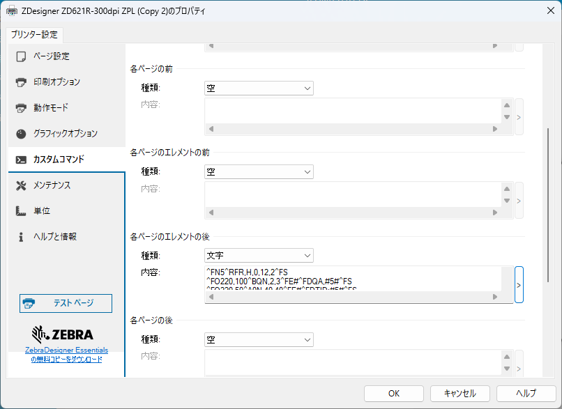

#### Zebra-Printer_Print_EPC_and TID_Information
## RFIDラベルのTID/EPC情報を印刷、ホストに送信するサンプルZPL

印刷と同時にインレイの情報を取得し、文字やバーコードとして印刷したり、ホストに返信したい場合があります。その場合は、下記ZPLを参考にZPLを実装してみてください。


</br>


1. サンプルZPL

    ```
    ^XA   

    ; 文字印刷                       
    ^FO10,050^A0N,25,25^FN1^FS
    ^FO10,100^A0N,25,25^FN2^FS
    ^FO10,150^A0N,25,25^FN3^FS

    ; バーコード印刷
    ^FO350,030^BY2^BCN,50,Y,N,N^FN2^FS
    ^FO350,130^BY2^BCN,50,Y,N,N^FN3^FS

    ; FN1
    ^FN1^FD Zebra Sample! ^FS          

    ; バンク１情報の読み取り
    ^FN2^RFR,H,0,12,1^FS

    ; バンク２情報の読み取り
    ^FN3^RFR,H,0,12,2^FS

    ; HVでホスト出力
    ^FH_^HV1,,,_0D_0A,^FS
    ^FH_^HV2,,EPC: ,_0D_0A,^FS
    ^FH_^HV3,,TID: ,_0D_0A,^FS

    ^XZ                          
    ```

</br>

1. ホスト出力情報

    ```
    Zebra Sample!
    EPC: 39BB3000300833B2DDD90140
    TID: E280113020003919CEE90135
    ```

</br>

1. rfid.log.entries

    ```
    ! U1 getvar "rfid.log.entries"
    "<start>
    Aug-01-2025 10:09:03,R,B12,A1,17,00000000,39BB3000300833B2DDD90140
    Aug-01-2025 10:09:03,R,B12,A1,17,00000000,E280113020003919CEE90135
    <end>
    ```

</br>

### QRを印刷する場合

QRにEPC/TIDの情報を格納する場合は^FEを利用することで印刷ができるようになります。

    << Link-OS 6.8以上のみサポート>>

    ^XA
    ^PW900
    ^FN5^RFR,H,0,12,2^FS
    ^FO220,100^BQN,2,3^FE#^FDQA,#5#^FS
    ^FO220,50^A0N,40,40^FE#^FDTID:#5#^FS
    ^FH_^HV5,,TID: ,_0D_0A,^FS
    ^XZ

^FEの詳細については下記リンクを参照ください。

[Using FE Command to Read TID and Print it Into QR Code](https://supportcommunity.zebra.com/s/article/000028772?language=en_US&name=000028772)

</br>

## ZebraDeisgner 3 Proに追記する場合

ZebraDeisgner 3 ProからEPC/TIDの情報を印刷する場合は、マニュアルで作成したコードをカスタムコマンドとして登録することで対応が可能。

1. Zebra Designer 3 Proを起動し、任意のラベルデザインを作成する。
1. プリンタープロパティを選択
    ```
    "ドキュメントのプロパティ" > "プリンタープロパティ" 

1. "カスタムコマンド" > "各ページのエレメントの後" に任意のZPLコードを入力する。
    
    |||
    |-|-|
    |種類:| 文字
    |内容:| 追加したいZPLコードを入力

    
    </br>


1. [OK]を選択する。
1. 印刷をし、追加ZPLコードが反映されているか確認する。

</br>
</br>

#### 参考：作成されるZPL例

追加ZPLコードは^PQの前に挿入される。（★のコード）

    ```
    CT~~CD,~CC^~CT~
    ^XA
    ~JSN
    ^LT0
    ^PMN
    ^CI27
    ^XZ
    ^XA
    ^LS0
    ^FT782,270^A0N,42,43^FH\^CI28^FDZebra Technologies^FS^CI27
    ^FN5^RFR,H,0,12,2^FS ★
    ^FO220,100^BQN,2,3^FE#^FDQA,#5#^FS ★
    ^FO220,50^A0N,40,40^FE#^FDTID:#5#^FS ★
    ^PQ1,0,1,Y
    ^XZ
    ``

</br>
</br>


### 参考： RFID バンク番号一覧

<table border="1" cellpadding="8" cellspacing="0">
<thead>
    <tr>
    <th>メモリバンク名</th>
    <th>番号</th>
    <th>説明</th>
    </tr>
</thead>
<tbody>
    <tr>
    <td>Reserved</td>
    <td>00</td>
    <td>アクセスパスワードとキルパスワードを格納。タグの保護・無効化に使用。</td>
    </tr>
    <tr>
    <td>EPC</td>
    <td>01</td>
    <td>商品識別コード（EPC）を格納。サプライチェーンや在庫管理に使用。</td>
    </tr>
    <tr>
    <td>TID</td>
    <td>02</td>
    <td>チップ固有のID（Tag Identifier）を格納。読み取り専用。</td>
    </tr>
    <tr>
    <td>User</td>
    <td>03</td>
    <td>任意のユーザーデータを格納可能。カスタム情報や履歴管理などに使用。</td>
    </tr>
</tbody>
</table>